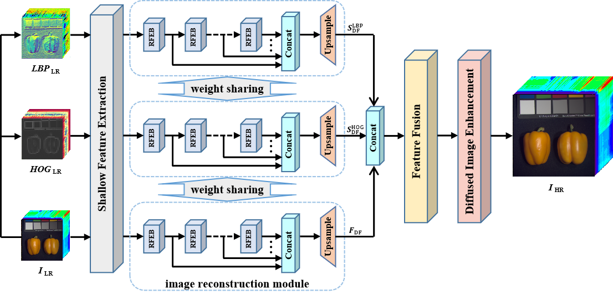

# DCNN
Pytorch implementation for "Closed-loop Matters: Dual Regression Networks for Single Image Super-Resolution".
<p align="center">

</p>


## Dependencies
```
Python>=3.7, PyTorch>=1.11, numpy, scipy, math, random, skimage, argparse
```

## Quickstart (Model Testing)
| Model | Scale | #Params (M) | PSNR on CAVE (dB) |
| :---: | :---: | :---------: | :---------------: |
| DCNN |   2   |     12.41     |       41.702       |
|      |   4   |     13.88     |       35.660       |
|      |   8   |     15.36     |       31.857       |


## Training Method

We use CAVE dataset () to train DCNN.

```bash
python main.py --train_path $TRAIN_DIR$ --test_path $TEST_DIR$\
--scale $SCALE$ --save_name $SAVE_MODEL_NAME$
```

- TRAIN_DIR: path to the training set
- test_path: path to the testing set
- SCALE: super resolution scale, such as 2, 4 and 8
- SAVE_DIR: file name for saving the model


For example, you can use the following command to train the DRN-S model for 4x SR.

```bash
python main.py --data_dir ./CAVE/train --test_path ./CAVE/test\
--scale 2 --save_name cave_x2_dcnn
```
